Tehtävät suoritettiin PoP!_OS-käyttöjärjestelmällä varustetulla isäntäkoneella. Laitteiston kokoonpano:
- Prosessori: AMD Ryzen 7 7700x
- Näytönohjain: Nvidia RTX 4070
- Muisti: 32 GB DDR5 RAM 6000mhz cl 32

  
Isäntäkoneella ajettiin Kali Linux -virtuaalikonetta, jolla oli seuraavat asetukset:

- Muisti: 4 GB RAM
- Prosessorit: 3


## x) Lue ja tiivistä
**[Broken access control](https://owasp.org/Top10/A01_2021-Broken_Access_Control/)** 
- Broken Access Control -haavoittuvuudessa käyttäjillä on pääsy tietoihin tai toimintoihin, jotka heidän oikeuksiensa mukaan tulisi olla kiellettyjä. 

**[Find Hidden Web Directories - Fuzz URLs with ffuf](https://terokarvinen.com/2023/fuzz-urls-find-hidden-directories/)**
-  Piilottettuja hakemistoja voidaan löytää fuzzauksen avulla käyttäen ffuf -työkalua, joka automatisoi hakemistojen etsimisen.

**[Access control vulnerabilities and privilege escalation](https://portswigger.net/web-security/access-control)**
- Artikkeli käsittelee pääsynhallinnan haavoittuvuuksia. 
  - Vertical access controls (Vertikaalinen pääsynhallinta) rajoittaa tiettyjä toimintoja vain tietyille käyttäjäryhmille. 
  - Horizontal access controls (Horisontaalinen pääsynhallinta) rajoittaa pääsyn resursseihin vain niiden omistajille.
  - Context-dependent access controls (Kontekstiin perustuva pääsynhallinta) varmistaa, että toiminnot suoritetaan oikeassa järjestyksessä. 

**[Raportin kirjoittaminen](https://terokarvinen.com/2006/raportin-kirjoittaminen-4/)**
- Hyvä raportti on tarkka, täsmällinen ja toistettavissa. Raportin tulee sisältää yksityiskohtainen kuvaus tehtävistä vaiheista ja tuloksista, jotta toinen henkilö voi seurata ja toistaa prosessin.

## a) Murtaudu 010-staff-only. Ks. Karvinen 2024: [Hack'n Fix](https://terokarvinen.com/hack-n-fix/)

Käytin tehtävän toteutukseen kali linux virtuaalikonetta. Latasin tehtävään tarvittavat tiedostot wget -komenolla `wget https://terokarvinen.com/tero-challenges.zip` ja purin tiedostot `unzip` -komennolla.

Siirryin 010-staff-only -kansioon ja käynnistin ohjelman `python staff-only.py` -komennolla.

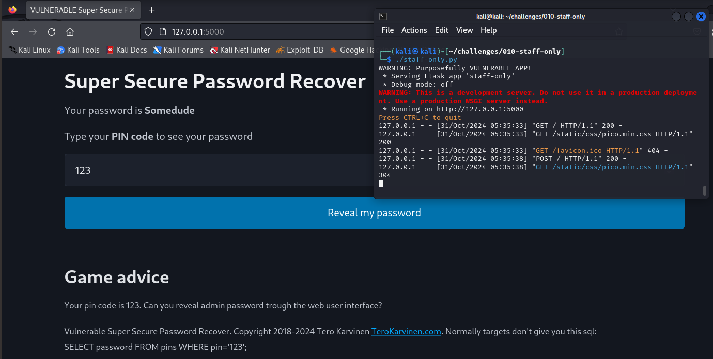

Lähdin kokeilemaan input -kenttään SQL injektio keinoja. Kokeilin ensiksi lisätä 123 pin koodin perään 'OR1=1--, joka ei toiminut, sillä syötekenttään pystyi laittaa vain numeroita, joten avasin Developer Tools -ikkunan ja poistin kentästä `type="number"` -määrityksen, jolloin voin syöttää PIN-koodikenttään myös merkkijonoja.

Testasin limit kyselyä `OR '1' = '1' limit 1 offset 1;--'`. Tässä lauseessa `OR '1' = '1'` tekee kyselystä aina toden. `limit 1 offset 1` ohjaa kyselyn hakemaan tietokannasta toisen tuloksen. Aloin tällä tavalla käydä salasanoja läpi löytääkseni oikean.

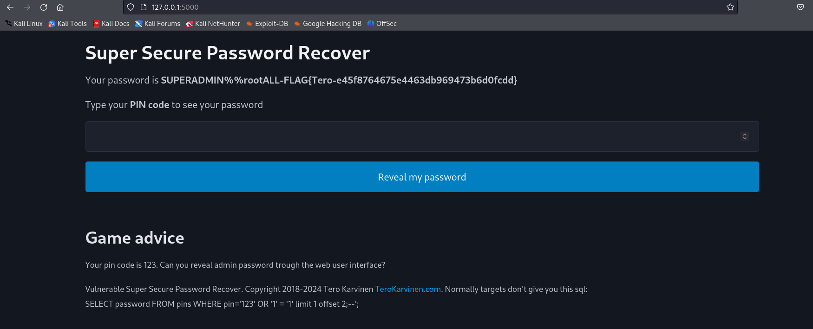

## Korjaa 010-staff-only haavoittuvuus lähdekoodista.
Siirryin katsomaan koodia, korjatakseni sen. Lähdin muokkaamaan alkuperäisen SQL-kysely rakenteeen ORM-pohjaisella ratkaisulla. Tällä ORM -mallilla tietokantakyselyt voidaan tehdä kirjoittamatta raakaa SQL -koodia. Koodin korjaamiseen käytin apuna [flask-sqlalchemy docsia.](https://flask-sqlalchemy.readthedocs.io/en/stable/quickstart/#define-models)

```
#!/usr/bin/python3
# Copyright 2018-2024 Tero Karvinen http://TeroKarvinen.com
#########################################
# WARNING: Purposefully VULNERABLE APP! #
#########################################

from flask import Flask, render_template, request # sudo apt-get install python3-flask
from flask_sqlalchemy import SQLAlchemy # sudo apt-get install python3-flask-sqlalchemy
from sqlalchemy import text 
from sqlalchemy.orm import Mapped, mapped_column


app = Flask(__name__)
app.config['SQLALCHEMY_DATABASE_URI'] = 'sqlite:///:memory:'
db = SQLAlchemy(app)

class Pin(db.Model):
    __tablename__ = "pins"
    id: Mapped[int] = mapped_column(primary_key=True)
    pin: Mapped[str]
    password: Mapped[str]

@app.route("/", methods=['POST', 'GET'])
def hello():
    pin = request.form.get("pin", "0")

    with app.app_context():
		#res=db.session.execute(text(sql))
		#db.session.commit()
		#row = res.fetchone()
        password = db.session.execute(db.select(Pin.password).where(Pin.pin==pin)).scalar_one_or_none()

	#if row is None:
	#	password="(not found)"
	#else:
	#	password=row[0]
    return render_template('index.html', password=password or "not found", pin=pin)

def runSql(sql):
	with app.app_context():
		res=db.session.execute(text(sql))
		db.session.commit()
		return res

def initDb():
	# For simplifying the demo, passwords are also incorrectly stored as plain text. 
	# However, that's not the only thing that's wrong.
	runSql("CREATE TABLE pins (id SERIAL PRIMARY KEY, pin VARCHAR(17), password VARCHAR(20));")
	runSql("INSERT INTO pins(pin, password) VALUES ('321', 'foo');")
	runSql("INSERT INTO pins(pin, password) VALUES ('123', 'Somedude');")
	runSql("INSERT INTO pins(pin, password) VALUES ('11112222333', 'SUPERADMIN%%rootALL-FLAG{Tero-e45f8764675e4463db969473b6d0fcdd}');")
	runSql("INSERT INTO pins(pin, password) VALUES ('321', 'loremipsum');")

if __name__ == "__main__":
	print("WARNING: Purposefully VULNERABLE APP!")
	initDb()
	app.run() # host="0.0.0.0" to serve non-localhost, e.g. from vagrant; debug=True for debug
```

Pin -classin lisääminen:

```
class Pin(db.Model):
    __tablename__ = "pins"
    id: Mapped[int] = mapped_column(primary_key=True)
    pin: Mapped[str]
    password: Mapped[str]

```
Pin luokka perii `db.Model` -luokan, mikä mahdollistaa kyselyjen tekemisen ilman raakaa SQL-koodia.
Attribuutit on määritelty käyttämällä `Mapped` -tyyppiä.

```
password = db.session.execute(db.select(Pin.password).where(Pin.pin==pin)).scalar_one_or_none()
```
ORM-kysely `db.select(Pin.password).where(Pin.pin == pin)` hakee tietokannasta `password` -kentän, jossa `pin` vastaa käyttäjän syötettä.
`.scalar_one_or_none()` funktio palauttaa ensimmäisen löydetyn tuloksen tai `none` , jos tuloksia ei ole.

Alkuperäinen koodi rakensi SQL-kyselyn suoraan käyttäjän syötteen pohjalta, mikä teki siitä alttiin SQL-injektiolle. ORM-pohjainen rakenne estää tämän, koska käyttäjän syöte koskaan pääse suoraan osaksi SQL-koodia.

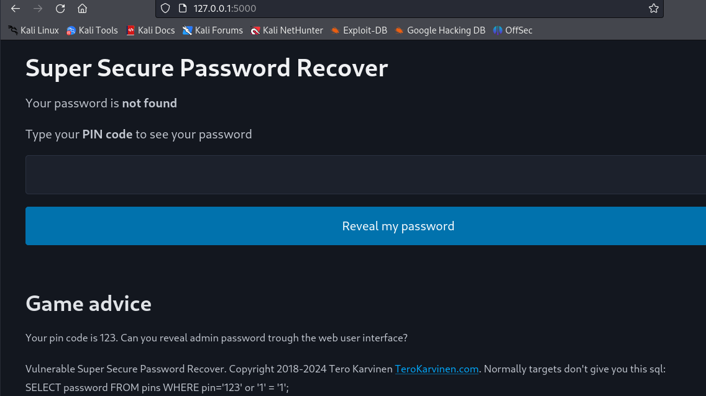

SQL-injektiot eivät vaikuttaneet enää toimivan. 

## Ratkaise dirfuzt-1 artikkelista Karvinen 2023: Find Hidden Web Directories - [Fuzz URLs with ffuf](https://terokarvinen.com/2023/fuzz-urls-find-hidden-directories/).

Aloitin tehtävän suorittamisen asentamalla ffuf -työkalun `sudo apt install ffuf` -komennolla.

Hain tehtävän komennolla `wget https://terokarvinen.com/2023/fuzz-urls-find-hidden-directories/dirfuzt-1`. Lisäsin ladattuun tiedostoon oikeudet, joilla saan ajettua sen. 

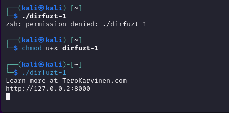

Latasin vielä sanakirjan yleisimmistä poluista, koska ffuf tarvitsee sanakirjan testattavista URL-polkujen nimistä. `wget https://raw.githubusercontent.com/danielmiessler/SecLists/master/Discovery/Web-Content/common.txt`

Ajoin komennon `ffuf -w common.txt -u http://127.0.0.2:8000/FUZZ`, joka käytti ffuf työkalua hakemistojen löytämiseen. Komennossa `-w` määrittää käytettävän sanakirjan ja `-u` määrittää osoitteen.

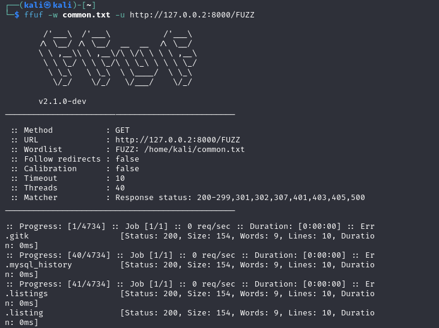

Katsoessani vastauksia näin, että suurinosa vastauksista oli 154 tavuisia. Suodatin nämä pois `ffuf -w common.txt -u http://127.0.0.2:8000/FUZZ -fs 154` -komennolla. Tässä `-fs` -parametri poistaa kaikki tulokset, jotka ovat kooltaan 154 tavua.
Filtteröinnin jälkeen vastauksia tuli huomattavasti vähemmän, ja vastauksista oletettavasti oikeellisin oli `wp-admin`.

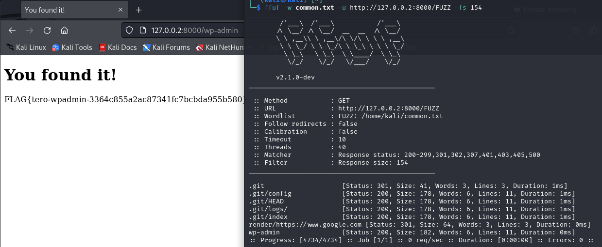

## Murtaudu 020-your-eyes-only. Ks. Karvinen 2024: [Hack'n Fix](https://terokarvinen.com/hack-n-fix/)

Ajoin komennon `python -m virtualenv venv`, joka loi virtuaaliympäristön. 
Aktivoin ympäristön `source venv/bin/activate` komennolla.

Asensin vaadittavat riippuvuudet `pip install -r requirements.txt` -komennolla. Tämä komento lukee requirements.txt-tiedoston ja asentaa siinä määritellyt asiat.

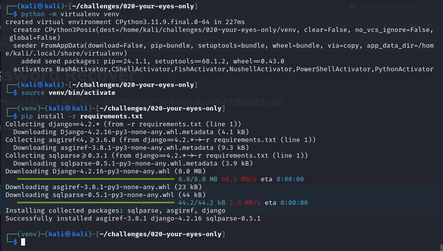

`/challenges/020-your-eyes-only/logtin` kansiossa suoritin tietokannan alustuksen `./manage.py makemigrations` ja `./manage.py migrate ` -komennoilla.

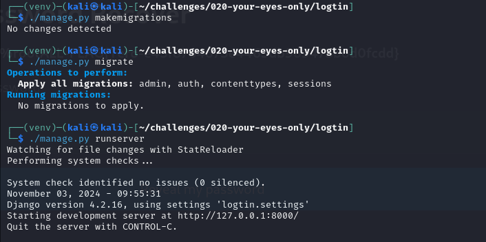

Käynnistin ohjelman `./manage.py runserver` -komennolla. Lähdin ensimmäisenä tutkimaan käyttöliittymää. Kirjauduin sovellukseen luomalla ensin uuden käyttäjätilin. Tutkittuani käyttöliittymää hetken Fuzzazin tarkistaakseni, löytyisikö piilotettuja hakemistoja. Ajoin komennon `ffuf -w common.txt -u http://127.0.0.1:8000/FUZZ
` ja fuzzerista hyppäsi esiin `admin-console`. 

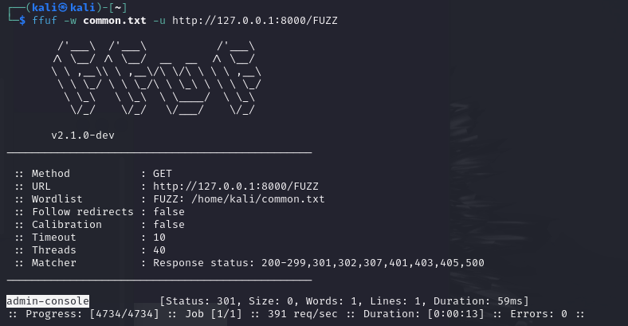

Lisäsin `admin-console` URL:n perään ja tämä salli pääsyn `Admin secret page`

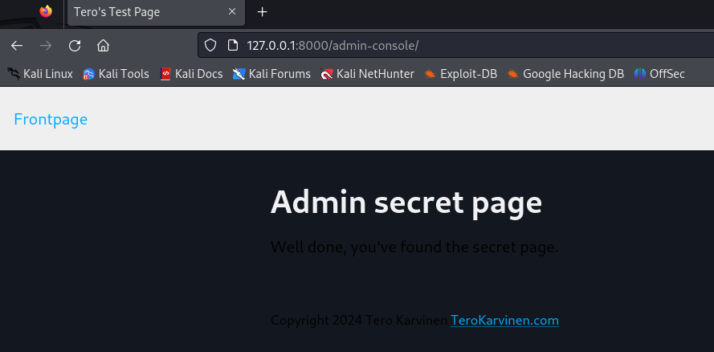

## Korjaa 020-your-eyes-only haavoittuvuus

Etsin ripgrep (komentorivillä käytettävä työkalu tiedostojen rekursiiviseen läpikäyntiin) -työkalulla missä tiedostossa `admin-console` -hakemistoa käytetään. Haluttu hakemisto löytyi `challenges/020-your-eyes-only/logtin/hats/urls.py`. 

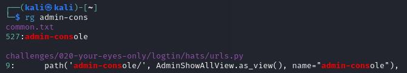

Suuntasin tarkastelemaan `urls.py` -tiedostoa. 

```
from django.urls import path
from django.views.generic import TemplateView
from .views import *

urlpatterns = [
	path('', TemplateView.as_view(template_name="hats/frontpage.html"), name="frontpage"),
	path('my-data/', MyDataView.as_view(), name="my-data"),
	path('admin-dashboard/', AdminDashboardView.as_view(), name="admin-dashboard"),
	path('admin-console/', AdminShowAllView.as_view(), name="admin-console"),
]

```

Tässä admin-console on yhdistetty näkymään AdminShowAllView, joka määritellään views.py-tiedostossa.

Navigoin seuraavaksi `views.py` -tiedostoon.


```
from django.views.generic import TemplateView
from django.contrib.auth.mixins import UserPassesTestMixin

class MyDataView(UserPassesTestMixin, TemplateView):
	template_name="hats/my-data.html"

	def test_func(self):
		return self.request.user.is_authenticated

class AdminDashboardView(UserPassesTestMixin, TemplateView):
	template_name="hats/admin-show-all.html"

	def test_func(self):
		return self.request.user.is_authenticated and self.request.user.is_staff

class AdminShowAllView(UserPassesTestMixin, TemplateView):
	template_name="hats/admin-show-all.html"

	def test_func(self):
		return self.request.user.is_authenticated
```

Tiedostossa määriteltiin sovelluksen näkymät, mukaan lukien `AdminShowAllView`
`AdminShowAllView` -luokassa ei ollut rajoitusta, joka olisi varmistanut, että käyttäjä on ylläpitäjä (is_staff), vaan se tarkisti vain, että käyttäjä on kirjautunut.

Lisäsin `test_func` -metodiin tarkistuksen, jolla varmistetaan, että vain `is_staff` -oikeuden omaavat käyttäjät pääsevät `admin-console` -sivulle

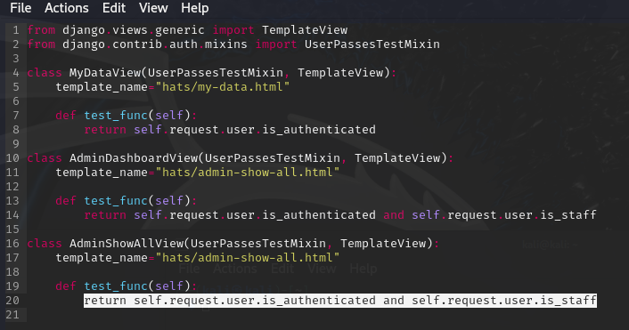

Kävin testaamassa koodin toimivuutta aikaisemmin luomalla käyttäjälläni ja en enää päässyt `admin-console` sivulle. 

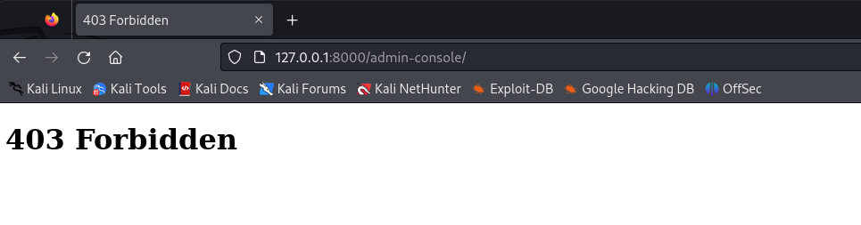

## g & j)
Molemmat tehtävät kerkesin tehdä 29.10.2024 tunnin aikana. 

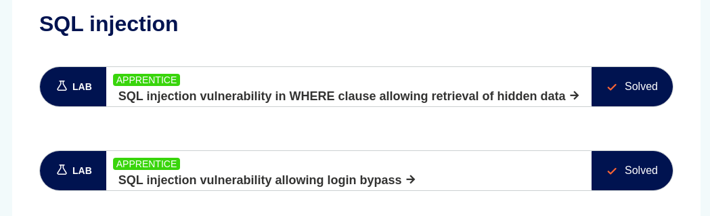

## Lähteet

Flask-Sqlaclhemy. Quick Start. Luettavissa: https://flask-sqlalchemy.readthedocs.io/en/stable/quickstart/

Karvinen, T. Application Hacking. https://terokarvinen.com/application-hacking

Karvinen, T. Find Hidden Web Directories - Fuzz URLs with ffuf. Luettavissa: https://terokarvinen.com/2023/fuzz-urls-find-hidden-directories/

Karvinen, T. Hack'n Fix. Luettavissa: https://terokarvinen.com/hack-n-fix/

Karvinen, T. Raportin kirjoittaminen. Luettavissa: https://terokarvinen.com/2006/raportin-kirjoittaminen-4/

Portswigger. Access control vulnerabilities and privilege escalation. Luettavissa: https://portswigger.net/web-security/access-control

OWASP. A01:2021 – Broken Access Control. Luettavissa: https://owasp.org/Top10/A01_2021-Broken_Access_Control/
