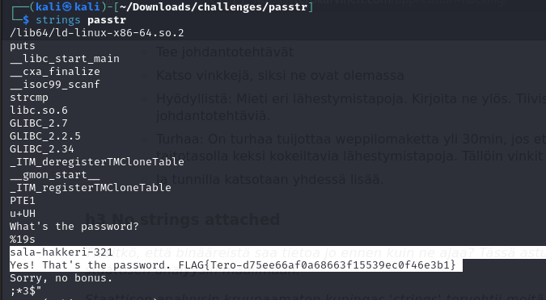
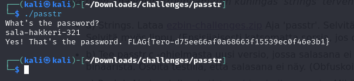
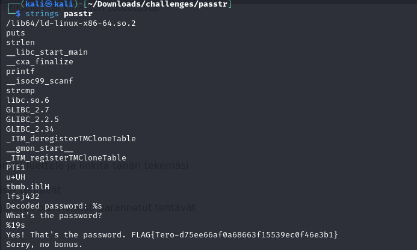
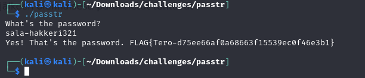
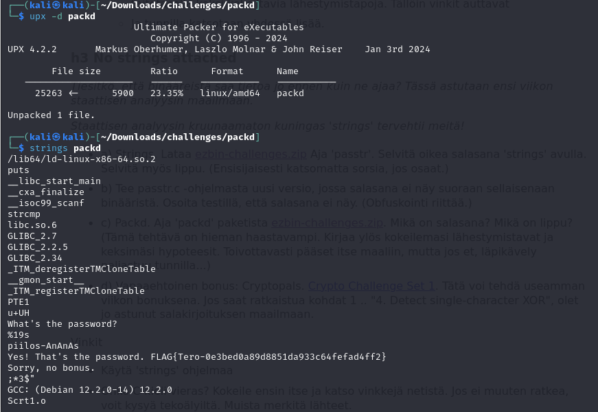
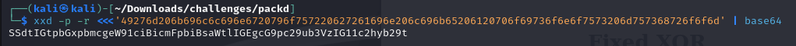
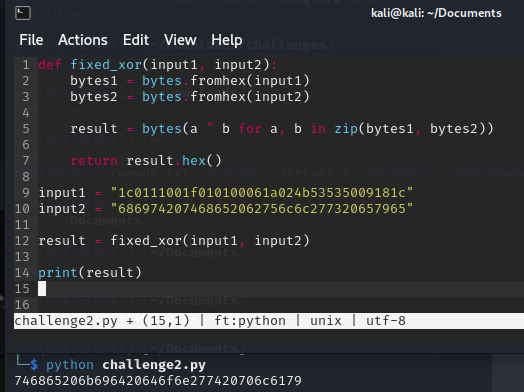

**Tehtävät suoritettiin PoP!_OS-käyttöjärjestelmällä varustetulla isäntäkoneella. Laitteiston kokoonpano:**

Prosessori: AMD Ryzen 7 7700x

Näytönohjain: Nvidia RTX 4070

Muisti: 32 GB DDR5 RAM 6000mhz cl 32

**Isäntäkoneella ajettiin Kali Linux -virtuaalikonetta, joka virtualisoitiin virtualbox ohjelmalla. Koneessa oli seuraavat asetukset:**

Muisti: 4 GB RAM

Prosessorit: 3


## a)

Latasin [Teron sivuilta](https://terokarvinen.com/application-hacking/#h3-no-strings-attached) ezbin-challenges.zip tiedoston ja avasin sen unzip -työkalulla.

Aloitin suuntaamalla passtr kansioon ja lukemalla README tiedoston. 
Latasin `sudo apt-get install make gcc micro` -komennolla tarvittavat ohjelmat.

Ajoin `strings passtr`, jolla löysin oikean salasanan. [Strings](https://www.ibm.com/docs/en/aix/7.2?topic=s-strings-command) -työkalu etsii binääritiedostosta kaikki luettavat merkkijonot. 



Ajoin vielä passtr tiedoston ja kokeilin, että salasana oli varmasti oikea. 




## b)
C-kieli ei ollut täysin itselleni entuudestaan tuttu, mutta olen ohjelmoinut muilla kielillä, jotka eivät suuresti poikkea C-kielestä.

[C-kielellä](https://digital.ai/catalyst-blog/how-to-obfuscate-c-code/) obfuskointi tapahtuu tässä tapauksessa merkkijononsalauksella.


```c
// passtr - a simple static analysis warm up exercise
// Copyright 2024 Tero Karvinen https://TeroKarvinen.com

#include <stdio.h>
#include <string.h>

int main() {
	char password[20];
	
	printf("What's the password?\n");
	scanf("%19s", password);
	if (0 == strcmp(password, "sala-hakkeri-321")) {
		printf("Yes! That's the password. FLAG{Tero-d75ee66af0a68663f15539ec0f46e3b1}\n");
	} else {
		printf("Sorry, no bonus.\n");
	}
	return 0;
}
```


Lähdin muuttamaan alkuperäistä koodia muokkaamalla salasanan [ascii arvoja](https://www.geeksforgeeks.org/ascii-table/). Tällä tavoin salasana näkyy binäärissä "salatussa" muodossa eikä ole suoraan luettavissa.

```c
// passtr - a simple static analysis warm up exercise
// Copyright 2024 Tero Karvinen https://TeroKarvinen.com

#include <stdio.h>
#include <string.h>

void decode_password(char *encoded, char *decoded) {
    for (int i = 0; i < strlen(encoded); i++) {
        decoded[i] = encoded[i] - 1;
    }
    decoded[strlen(encoded)] = '\0';
}

int main() {
    char password[20];
    char encoded_password[] = "tbmb.ibllfsj432"; // Dekoodattu version "sala-hakkeri-321"
    char decoded_password[20];

    decode_password(encoded_password, decoded_password);
    
    printf("What's the password?\n");
    scanf("%19s", password);

    if (0 == strcmp(password, decoded_password)) {
        printf("Yes! That's the password. FLAG{Tero-d75ee66af0a68663f15539ec0f46e3b1}\n");
    } else {
        printf("Sorry, no bonus.\n");
    }

    return 0;
}
```

Alkuperäinen salasana "sala-hakkeri-321" tallennettiin salatussa muodossa `encoded_password` -muuttujaan. Jokaisen merkin ASCII-arvoa kasvatettiin yhdellä.
`decode_password` -funktio palauttaa salasanan alkuperäisen tekstin purkamalla jokaisen merkin ASCII-arvoa yhdellä vähentämällä.

`scanf` kerää käyttäjän syötteen ja salasanan oikeellisuus tarkistetaan vertaamalla purettua salasanaa ja käyttäjän antamaa salasanaa.

Tein muutokset tiedostoihin ajamalla terminaalissa "make", koska kansiossa oli valmiina tiedosto `Makefile`, jossa oli komento `gcc passtr.c -o passtr`, joka käänsi ohjelman.

Muokkaamani koodi vaikutti toimivan halutulla tavalla, ja piilotti salasanan siten, ettei se ollut enää `strings` -työkalulla luettavissa. 






## c)
Tässäkin tehtävässä lähdin liikkeelle ajamalla `strings packd` -komennolla.
Terminaalin tulosteen perusteella oletin, että salasana ei ole täysin piilotettu, sillä sielä näkyi `piilos-An`. Kokeilin tätä ja kuten arvata saattaa, se ei ollut oikea salasana. Hieman alempana tulosteessa näkyi `This file is packed with the UPX executable packer http://upx.sf.net`, joten lähdin tutkimaan mikä tämä UPX on (tästä kohdasta unohtui ottaa kuva). 

Selvisi, että [UPX](https://github.com/upx/upx) on pakkausohjelma. UPX ohjelmia voidaan [purkaa](https://medium.com/@ankyrockstar26/unpacking-a-upx-malware-dca2cdd1a8de#:~:text=packed%20executables%2C%20including%3A-,UPX%20Tool%3A,-The%20UPX%20tool) `upx -d` komennolla.



Ajoin siis komennon `upx -d packd` joka purki ohjelman. Tämän jälkeen kokeilin jälleen `strings packd`, joka nyt palautti salasanan kokonaisena. Syötettyäni salasanan ohelmaan saatoin todeta sen olevan oikea. 


## d)

1. Lähdin ensimmäisenä googlettamaan, miten käännän terminaalissa hexaa Base64-muotoon. Löysin suosikki sivulleni stack overflowhun josta löysin [tämän](https://stackoverflow.com/questions/55399623/how-to-hex-to-base64-in-shell-script-different-output-expected)
Käytin komentoa `xxd -p -r <<<'49276d206b696c6c696e6720796f757220627261696e206c696b65206120706f69736f6e6f7573206d757368726f6f6d' | base64`. `xxd` yleensä muuntaa binääridatan heksadesimaalimuotoon, `-p` on postscript muoto, jossa data tulkintaan heksadesimaalimuodossa. `-r` kääntää heksadesimaalin takaisin binääriin.
Tämä komento palautti halutun `SSdtIGtpbGxpbmcgeW91ciBicmFpbiBsaWtlIGEgcG9pc29ub3VzIG11c2hyb29t`



2. Toiseen haasteeseen tarkastin kuinka [XOR operaatiot toimivat pythonilla](https://www.geeksforgeeks.org/get-the-logical-xor-of-two-variables-in-python/). Tein yksinkertaisen python ohjelman, jolla sain ratkaistua tämän. 
```python
def fixed_xor(input1, input2):
    bytes1 = bytes.fromhex(input1)
    bytes2 = bytes.fromhex(input2)
    
    result = bytes(a ^ b for a, b in zip(bytes1, bytes2))
    
    return result.hex()

input1 = "1c0111001f010100061a024b53535009181c"
input2 = "686974207468652062756c6c277320657965"

result = fixed_xor(input1, input2)

print(result)
```



** Jatkan näitä vielä kurssin edetessä **

## Lähteet

Karvinen, T. Sovellusten hakkerointi, h3. Luettavissa: https://terokarvinen.com/application-hacking/#h3-no-strings-attached

IBM. Strings command. Luettavissa: https://www.ibm.com/docs/en/aix/7.2?topic=s-strings-command

Digital.ai. How to Obfuscate C Code. Luettavissa: https://digital.ai/catalyst-blog/how-to-obfuscate-c-code/

Geeks for Geeks. Ascii table. Luettavissa: https://www.geeksforgeeks.org/ascii-table/

Geeks for Geeks. Luettavissa: https://www.geeksforgeeks.org/get-the-logical-xor-of-two-variables-in-python/

UPX. XOR of Two Variables in Python. Luettavissa: https://github.com/upx/upx

Medium .UPX tool. Luettavissa: https://medium.com/@ankyrockstar26/unpacking-a-upx-malware-dca2cdd1a8de#:~:text=packed%20executables%2C%20including%3A-,UPX%20Tool%3A,-The%20UPX%20tool

Stack Overflow. How to Hex to Base64 in shell script (different output expected)?. Luettavissa: https://stackoverflow.com/questions/55399623/how-to-hex-to-base64-in-shell-script-different-output-expected


