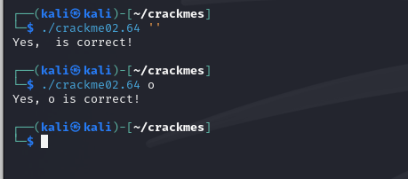

**Tehtävät suoritettiin PoP!_OS-käyttöjärjestelmällä varustetulla isäntäkoneella. Laitteiston kokoonpano:**

Prosessori: AMD Ryzen 7 7700x

Näytönohjain: Nvidia RTX 4070

Muisti: 32 GB DDR5 RAM 6000mhz cl 32

**Isäntäkoneella ajettiin Kali Linux -virtuaalikonetta, joka virtualisoitiin virtualbox ohjelmalla. Koneessa oli seuraavat asetukset:**

Muisti: 4 GB RAM

Prosessorit: 3

## x)

## x) Lue/katso/kuuntele ja tiivistä.

John Hammon käy videossaan ["Ghidra for reverse engineering"](https://www.youtube.com/watch?v=oTD_ki86c9I) läpi PicoCTF bbbloat tehtävän ratkaisua ghidran avulla. 

- Hammond käyttää Ghidran "Defined Strings" -ominaisuutta löytääkseen binääristä tehtävän ratkaisun kannalta olennaisen merkkijonon. 

- Merkkijonojen kautta Hammond pääsee oikeaan kohtaan assembly-koodissa, mikä antaa lisätietoa ohjelman logiikasta ja toiminnasta.

- Hän demonstroi kuinka muuttujien nimiä voidaan mmuokata, jotta ohjelman ymmärtäminen helpottuisi. 

- Videolla Hammond löytää dekompiloidusta koodista ratkaisuun johtavan heksadesimaaliarvon, jonka hän muuntaa oikeaksi vastaukseksi Pythonin avulla.


## a)

Asensin ghidran kalin paketinhallinnasta `sudo apt-get install ghidra`

## b) rever-C. Käänteismallinna packd-binääri C-kielelle Ghidralla. Etsi pääohjelma. Anna muuttujielle kuvaavat nimet. Selitä ohjelman toiminta. Ratkaise tehtävä binääristä, ilman alkuperäistä lähdekoodia

Tein ghidraan uuden projektin nimeltä `ghidra`
Importtasin `packd` tehtävän, jonka olin purkanut `upx -d` -komennolla.


Ohjelma kysyi haluanko analysoida `packd` tiedoston, vastasin kyllä ja pidin oletus oletusanalysoijat.


Navigoin binäärin sisääntulopisteeseen ja löysin main-funktion. 


Muokkasin muuttujien nimet osuvammiksi. 


Ohjelma kysyy käyttäjältä syötteen ja vertaa sitä ennalta määriteltyyn salasanaan. Jos käyttäjän syöte täsmää oikean salasanan kanssa, ohjelma tulostaa onnistumisviestin ja näyttää lipun. Jos syöte ei täsmää, ohjelma ilmoittaa virheellisestä salasanasta.

## c) Jos väärinpäin. Muokkaa passtr-ohjelman binääriä (ilman alkuperäistä lähdekoodia) niin, että se hyväksyy kaikki salasanat paitsi oikean. Osoita testein, että ohjelma toimii.

Importtasin `passtr` -ohjelman Ghidraan ja suoritin ohjelman analysoinnin. Navigoin `main` -funktioon, josta löytyi ohjelman logiikka.

Assembly patchataan avaamalla `Patch Instruction` -ikkuna.


Korvasin `JNZ` -käskyn `NOP` -käskyllä (no operation), jotta ohjelma ei hyppää yli lipun tulostuskohdasta, riippumatta siitä, mitä syötettä annetaan.


Exportasin muokatun binäärin `Original File` -muodossa.


Annoin binäärille suoritusoikeudet terminaalissa ja testasin ohjelmaa. Ohjelma tulosti onnistumisviestin väärällä salasanalla.


## d) Nora CrackMe: Käännä binääreiksi Tindall 2023: NoraCodes / crackmes. Lue README.md: älä katso lähdekoodeja, ellet tarvitse niitä apupyöriksi. Näissä tehtävissä binäärejä käänteismallinnetaan. Binäärejä ei muokata, koska muutenhan jokaisen tehtävän ratkaisu olisi vaihtaa palautusarvoksi "return 0".

Kloonasin [crackmes](https://github.com/NoraCodes/crackmes) repon itselleni.


## e) Nora crackme01. Ratkaise binääri.

Ajoin `make crackme01` ja importoin tiedoston ghidraan. 


Avasin main funktion ja vaihdon sen parametrit selkeämmiksi.

Ghidran dekompiloidun koodin mukaan ohjelma ottaa komentoriviparametrin vastaan, joka vertailee sitä merkkijonoon `password1`


Ajoin ohjelman terminaalissa ja annoin `password1` -salasanan komentoriviparametrina. Ohjelma toimi oletetusti ja hyväksyi kyseisen salasanan.


## f) Nora crackme01e. Ratkaise binääri.

Käänsin `crackme01e` -tiedoston `make` -komennolla, minkä jälkeen importoin ja analysoin sen Ghidraan oletusasetuksilla.


Etsin main funktion ja etsin sieltä kohdan jossa verrattiin komentoriviparametria tiettyyn merkkijonoon. Oletin tämän merkkijonon olevan oikea salasana, kuten aiemmassa tehtävässä. Tässä tapauksessa vertailtava merkkijono oli `slm!paas.k`.


Ajoin ohjelman terminaalissa ja syötin siihen `'slm!paas.k'`, se meni läpi.


## g) Nora crackme02. Nimeä pääohjelman muuttujat käänteismallinnetusta binääristä ja selitä ohjelman toiminta. Ratkaise binääri.

Käänsin `crackme02` -tiedoston `make` -komennolla, importoin ja analysoin ghidraan.

Avasin main-funktion, tarkastelin sen toimintaa ja vaihdoin muuttujien nimet selkeämmiksi: `index`, `curr_char` ja `pass_char`. 


   

Ohjelmassa käydään läpi salasanaa ja käyttäjän syötettä merkki kerrallaan. Jokaista salasanan merkin ASCII-arvoa vähennetään yhdellä ja vertaillaan käyttäjän syötteeseen. 
Jos merkit eivät vastanneet toisiaan, ohjelma tulosti virheilmoituksen ja päätti suorituksensa. 
Do-while looppi jatkuu, kunnes saavutaan merkkijonon loppuun (nollatavu eli `\0`), mikä on tavallinen C-kielen tapa merkitä merkkijonon loppu.

Kirjoitin nopean pythin sriptin, jonka avulla miinustin `password1` ascii arvoista yhden merkin. 

```python

password = "password1"

for i in password
    print(chr(ord(i) - 1), end="")
print()

```

`ord()` -funktio antaa merkin ASCII-arvon.
`chr()` -funktio muuttaa ASCII-arvon takaisin merkiksi.
`end=""` pitää tulosteen samalla rivillä, muodostaen koko muunnetun salasanan yhtenäisenä merkkijonona.

Kun olin selvittänyt oikean salasanan, ajoin ohjelman terminaalissa ja syötin sen parametriksi. Ohjelma hyväksyi syötteen oikeaksi salasanaksi.

 
 
 ## Pyytämättäkin. Crackme02 on kaksi ratkaisua. Löydätkö molemmat?
 
 Kaksi löytämääni tapaa: 
 - **Tyhjä syöte**: Jos syöttää tyhjää `''`, ohjelma palauttaa oikean vastauksen.
 
 - **Pelkkä `o` merkki**: Jos syöttää pelkän `o` ohjelma palauttaa oikean vastauksen.

Ohjelma käy läpi salasanaa ja käyttäjän syötettä merkki kerrallaan, kunnes jommasta kummasta syötteestä loppuvat merkit. Tarkistusprosessissa ohjelma lopettaa ajamisen heti, kun se havaitsee, että yksikään merkki ei täsmää. Jos kaikki tarkistetut merkit täsmäävät, ohjelma antaa onnistumisviestin.

Tämän logiikan vuoksi tyhjän merkkijonon syöttäminen hyväksytään, koska tarkistuksessa ei löydy yhtään virhettä, kun merkkejä ei ole, mitään ei tarvitse hylätä. Samoin pelkkä o hyväksytään, koska ohjelma tarkistaa vain ensimmäisen merkin ja päättää, että se riittää täsmäämään.

 
 
## Lähteet

https://github.com/NoraCodes/crackmes

Karvinen, T. Application hacking, h4 kääntöpaikka. https://terokarvinen.com/application-hacking/#h4-kaantopaikka

Hammond, J. GHIDRA for Reverse Engineering :https://www.youtube.com/watch?v=oTD_ki86c9I
