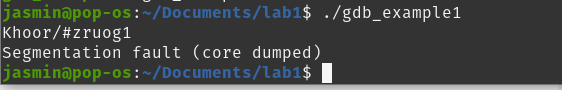
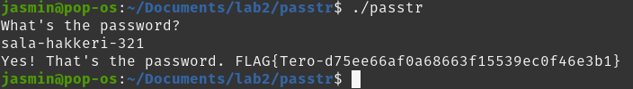
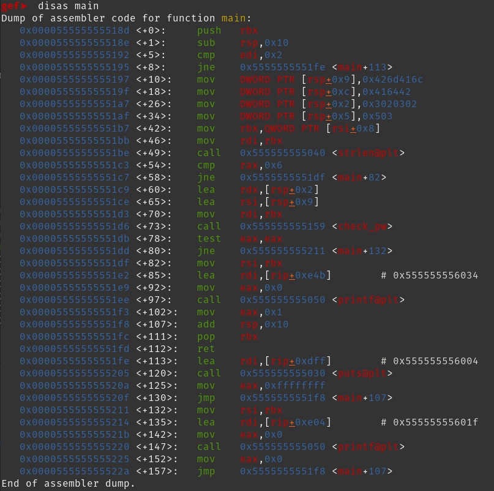

## a) Lab1. Tutkiminen mikä on ohjelmassa vialla ja miten se korjataan.

Aloitin tutkimalla ohjelman toimintaa ajamalla sen. Tulosteen perusteella ohjelmassa oli muistiongelma, joka aiheutti segmentation fault -virheen. Tämä viittaa siihen, että ohjelma yritti käyttää muistialuetta, johon sillä [ei ollut oikeuksia](https://stackoverflow.com/questions/19641597/what-is-segmentation-fault-core-dumped). 



```c
#include "stdio.h"

void print_scrambled(char *message)
{
  register int i = 3;
  do {
    printf("%c", (*message)+i);
  } while (*++message);
  printf("\n");
}

int main()
{
  char * bad_message = NULL;
  char * good_message = "Hello, world.";

  print_scrambled(good_message);
  print_scrambled(bad_message);
}
```

Lähdin korjaamaan alkuperäistä koodia. 

Käytin gdb-debuggeria ohjelman tutkimiseen. Ajoin gdb `disas main`, joka disassemblaa main funktion.


Huomasin `print_scrambled` funktion joten ajoin `disas print_scrambled`.


Asetin breakpontin `print_scrambled`:
- Suoritin ohjelman `run` komennolla.
- Ohjelma pysähtyi ensimmäiseen breakpointiin, jolloin tutkin tilan ja jatkoin ajamista (continue).
- Toinen pysähtyminen osoitti, että ohjelma yritti käsitellä bad_message-osoitinta, joka on NULL.


Ohjelma kaatui toisen kutsun aikana, mikä vahvisti, että segfault tapahtuu, kun funktiolle annetaan NULL-osoitin.

Korjasin ongelman lisäämällä tarkistuksen `print_scrambled` -funktioon, joka varmistaa, että argumentti ei ole `NULL`. 
```c
#include "stdio.h"

void print_scrambled(char *message)
{
  if (message==NULL){
	return;
  }
  register int i = 3;
  do {
    printf("%c", (*message)+i);
  } while (*++message);
  printf("\n");
}

int main()
{
  char * bad_message = NULL;
  char * good_message = "Hello, world.";

  print_scrambled(good_message);
  print_scrambled(bad_message);
}
```


## b) Lab2. Selvitä salasana ja lippu + kirjoita raportti siitä miten aukesi.

passtr salasanan arvasin.



Aloitin tutkimaan ohjelmaa passtr2o käyttämällä `strings` komentoa. Mielenkiinnon herätti "anLTj4u8" merkkijono. 
Oletin, että tämä oli obfuskoitu salasana.


Aloitin ohjelman tutkimisen GDB:ssä ajamalla `gdb ./passtr2o` -komennon. 

Disassembloin main-funktion `disas main` komennolla.


Disassembloin myös EaseEAs-funktion `disas EaseEAs` komenolla. Tässä funktiossa oli strlen-kutsu, mikä viittasi siihen, että funktio saattaa käsitellä merkkijonoja.


Yritin asettaa breakpointin funktion return-kohtaan, mutta Breakpointia ei voitu asettaa, koska osoite osoitti epävalidiin paikkaan.


Asetin sen sijaan breakpointin main-funktion alkuun ja suoritin ohjelman uudelleen nähdäkseni, miten EaseEAs etenee.
Halusin nähdä, mitä tapahtuu funktion lopussa, jos siinä olisi salasana muistissa. 
Asetin breakpointin uudelleen EaseEAs-funktion palautukseen, mutta tämä yritys epäonnistui, koska breakpoint ei koskaan laukea.


Palasin takaisin `main` -funktioon ja jatkoin tutkimista. 
Huomio kiinnittyi `scanf` kutsuun, missä käyttäjän syöte luetaan. joten oletin vertailun tapahtuvan joskus tämän jälkeen.

Huomio kiinnittyi myös `0x000055555555511b <+155>:	call   0x555555555050 <printf@plt>` tällä rivillä todennäköisesti printataan lippu. 

Yritin hypätä suoraan lipun tulostuksen kohdalle `jump *0x000055555555511b` komennolla. Tämä ei kuitenkaan toiminut, koska muistissa ei oletettavasti ollut tarvittavia tietoja lipun tulostamiseksi.


Seuraava kiinnostava kohta: `0x00005555555550fb <+123>:	call   0x55555555525a <mAsdf3a>` tämä rivi herätti mielenkiinnon, koska se on heti scannin jälkeen, joten ryhdyin tutkimaan sitä.

Disassembloin mAsdf3a-funktion ajamalla `disas mAsdf3a`. Tulosteessa näkyi kaksi strlen funktio kutsua, mikä viittaa siihen, että käyttäjän syötteen ja obfuskoitua salasanaa verrataan.


Erityisen mielenkiintoinen kohta oli seuraava: `0x000055555555527f <+37>:    jne    0x5555555552af <mAsdf3a+85>` Tässä ehdollinen hyppy (jne, jump not equal) näyttää tapahtuvan, jos käyttäjän syötteen pituus ei vastaa obfuskoidun salasanan pituutta. Arvelin, että jos pituudet eivät täsmää, salasanaa ei edes yritetä deobfuskoida.

Latasin tässä vaiheessa GEF (GDB Enhanced Features) -lisäosan saadakseni selkeämmän näkymän ohjelman toimintaan. Tämä tapahtui hyvin turvallisella tavalla ajamalla terminaalissa `bash -c "$(curl -fsSL https://gef.blah.cat/sh)"` -komennon.


Asetin breakpointin kohtaan, jossa merkkijonojen pituuksia verrattiin, ja suoritin ohjelman antamalla samanpituisen salasanan kuin obfuskoitu salasana. Koska pituudet täsmäsivät, ohjelma jatkoi eteenpäin.
Menin ohjelmassa eteenpäin käyttäen GDB:n ni-komentoa (next instruction), kunnes ohjelma päättyi tuloksella `sorry no bonus`, eikä muistissa näkynyt oikeaa salasanaa.

Käynnistin ohjelman uudelleen ja menin viimeisimpään breakpointiin asti käyttämällä 12345678 salasanaa. Jatkoin eteenpäin, kunnes päädyin takaisin main funktioon ja jatkoin `ni` komennolla eteenpäin.
 
Salasana tarkistus funktion jälkeen näkyy jne ohjeistus, joka hyppää toisen funktion yli: `0x0000555555555111 <+145>:	call   0x555555555219 <EaseEAs>`. Tämä vaikutti liittyvän lipun tulostukseen, koska EaseEAs-funktio kutsuttiin vain, jos tarkistus onnistui. 
Etenin ohjelmassa `ni`-komennolla hypyn kohdalle ja käytin `jump`-komentoa ohittamaan ehtohypyn: (käytännössä skippasin `jne` ohjeistuksen hypyn). Tämän avulla pääsin lipun tulostuksen koodiin, mutta salasana oli edelleen mysteeri.


Seuraamalla `mAsdf3a` -funktion silmukkaa havaitsin, että salasana käsiteltiin seuraavasti:
- parittomille merkeille lisättiin 3 `0x555555555299 <mAsdf3a+003f> add    edx, 0x3`
- parillisilta merkeiltä vähennettiin 7 `0x555555555294 <mAsdf3a+003a> sub    edx, 0x7`
Nämä toistuvat vuorotellen jokaiselle merkkijonon merkille, kunnes kaikki merkit on käsitelty.


Tein nopean python scriptin jolla käänsin salasanan.

```py
obf = "anLTj4u8"

for i, char in enumerate(obf, start=1):
    if i % 2 == 0:
        print(chr(ord(char)-7), end="")
    else: 
        print(chr(ord(char)+3), end="")
    
print()
```


## c) Lab3. Kokeile Nora Crackmes harjoituksia tehtävä 3 ja 4 ja loput vapaaehtoisia.

#### crackme03
Ajoin ohjelman en arvannut salasanaa, joten ryhdyin selvittämään sen.
Katsoin miten gdb laitetaan [komentoriviargumentteja](https://stackoverflow.com/questions/6121094/how-do-i-run-a-program-with-commandline-arguments-using-gdb-within-a-bash-script)

Aloitin ohjelman `gdb --args ./crackme03.64 asdfgh` -komennolla.

Disassembloin main-funktion `disas main`. 



Tässä vaiheessa silmät alkoivat olla ristissä ja halusin nopeuttaa tehtävän tekemistä ja päätin antaa tulosteen chatgpt tarkasteltavaksi. 
ChatGPT:n avustuksella havaitsin, että ohjelma tarkistaa syötteen pituuden: ` 0x00005555555551c3 <+54>:	cmp    rax,0x6` 

Seuraavaksi kiinnitin huomiota `check_pw` -funktioon, joka oletettavasti vastaa salasanan tarkistamisesta: `0x00005555555551d6 <+73>:	call   0x555555555159 <check_pw>`

Päätin disassembloida check_pw-funktion `disas check_pw` komennolla.


Asetin breakpointin check_pw-funktion returniin `break *0x000055555555518c`
Suoritin ohjelman, mutta huomasin, että breakpoint ei koskaan lauennut. Tämän vuoksi suoritin ohjelman uudelleen ja aloin käydä koodia läpi askel kerrallaan `ni` -komennolla.

Tullaan kohtaan, jossa kutsutaan check_pw funktiota ja rsi rekisterissä näkyy mielenkiintoinen merkkijono "lAmBdA".


Kokeilemalla selvisi, että `lAmBdA` ei ollut suoraan oikea salasana.

Käytin si-komentoa (step in) siirtyäkseni `check_pw` -funktion sisälle ja jatkoin `ni` komennolla siihen asti että `check_pw` -funktio laittoi 0 eax/rax rekisteriin, eli viittaa epäonnistumiseen.

Ajoin `set $rax = 1`, joka viittaa onnistumiseen. Käytännössä huijasin ja muutin salasanan tarkistuksen tuloksen. Tämä ei kuitenkaan ole oikea tapa ratkaista tätä, mutta aika meemi.


Jatkoin `ni` -komennolla ja menin manuaalisesti seuraavaan kohtaan:

```
=> 0x0000555555555162 <+9>:	add    cl,BYTE PTR [rsi+rax*1]
```

`cl` -rekisterin arvo lisätään obfuskoidun salasanan merkkeihin.

`info registers cl` -komenolla (komento lyhennettynä `i r cl`) katsotaan mitä cl rekisterissä on eli mitä merkkiin plussataan. 

```
   0x0000555555555165 <+12>:	cmp    BYTE PTR [rdi+rax*1],cl
```

tällä rivillä vertaillaan salasanan ensimmäistä merkkiä.

Ensimmäisen vertailun kohdalla cl-rekisterissä oli arvo 2, joten ensimmäiseen merkkiin (l) lisätään 2.

Käytin seuraavaa GDB-komentoa korjatakseni käyttäjän syötettä `set $rdi = "n23456"`

Ohjelma eteni loopin toiseen iteraatioon. Tarkistin jälleen cl-rekisterin arvon:

`i r cl` seuraava cl rekisteri oli: `cl 0x3`

Tällä tapaa läpikäymällä selvisi että merkkijonon merkkeihin lisätään seuraavan mukaisesti: 2 -> 3 -> 2 -> 3 -> 5 -> 0 == nDoEiA


#### crackme04

Aloitin ohjelman salasanan selvittämisen kokeilemalla eri arvoja. Käytin komentoa `gdb --args ./crackme04.64 asdfgh` ajaakseni gdb:n siten, että se asettaa komentoriviparametrin.

Aloitin disassembloimalla main-funktion `disas main`

Huomasin, että ohjelma tarkistaa, että merkkijonon pituus tulisi olla 16 merkkiä. `0x0000000000001195 <+53>: cmp    edi,0x10`

Korjasin syötteen pituuden 16 merkkiä pitkäksi ja testasin salasanaa `./crackme04.64 qwertyuiopasdfgh`

Ohjelma hylkäsi syötteen edelleen. Jatkoin analyysiä tarkastelemalla lisää ehtoja main-funktiossa. 

Käynnistin ajamalla `gdb --args ./crackme04.64 qwertyuiopasdfgh`

Seuraava mielenkiintoinen osa liittyi kohtaan, jossa kaikkien merkkien ascii arvojen summaa verrattiin
`0x000000000000119a <+58>: cmp    ecx,0x6e2`
ecx-rekisteriin tallennettiin syötteen merkkien summan laskenta, ja sitä verrattiin arvoon 0x6e2 (1762 desimaalina). 

laitoin break pointin vertailu kohtaan `0x000000000000119a <+58>:	cmp    ecx,0x6e2`.

Korjasin syötteen "qwertyuiopasdfgh" niin, että sen merkkien summa olisi 1762. vaihdoin `qwertyuiopasdfgh -> qwertyuiopmsdfgh` a -> m.

ASCII-arvojen summa vastasi nyt tarkistuksen ehtoa 0x6e2.

salasanan summa on oikein ja palautuu oikea salasana.


## lähteet

https://terokarvinen.com/application-hacking/#h5-se-elaa

`man ascii`

https://github.com/hugsy/gef

https://stackoverflow.com/questions/6121094/how-do-i-run-a-program-with-commandline-arguments-using-gdb-within-a-bash-script

registers: https://stackoverflow.com/questions/20637569/assembly-registers-in-64-bit-architecture/20637866#20637866
