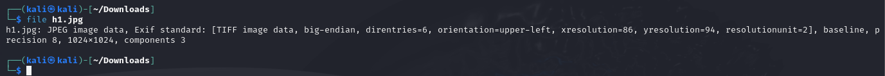
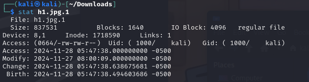
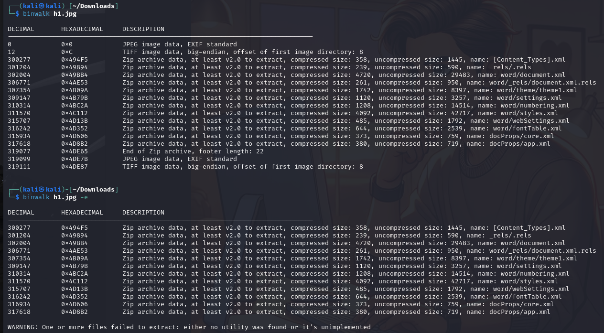
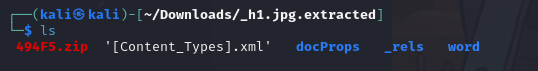
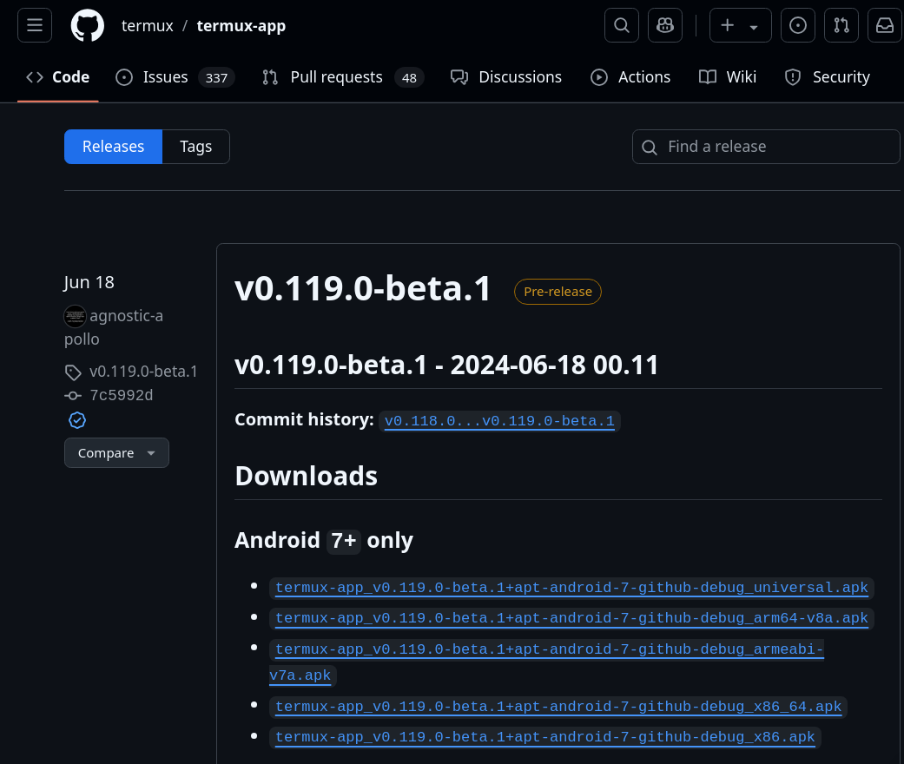
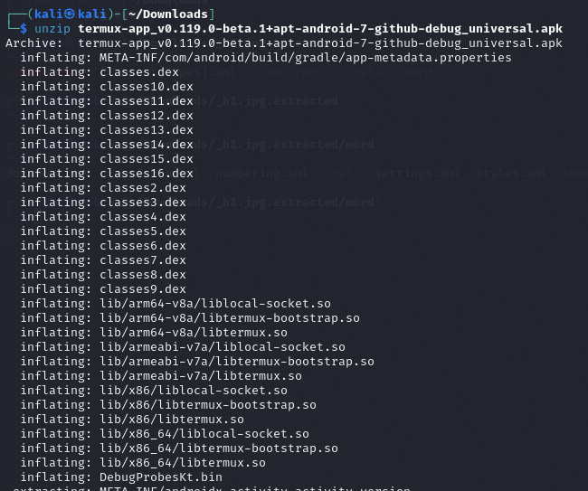
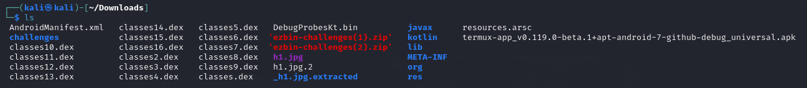
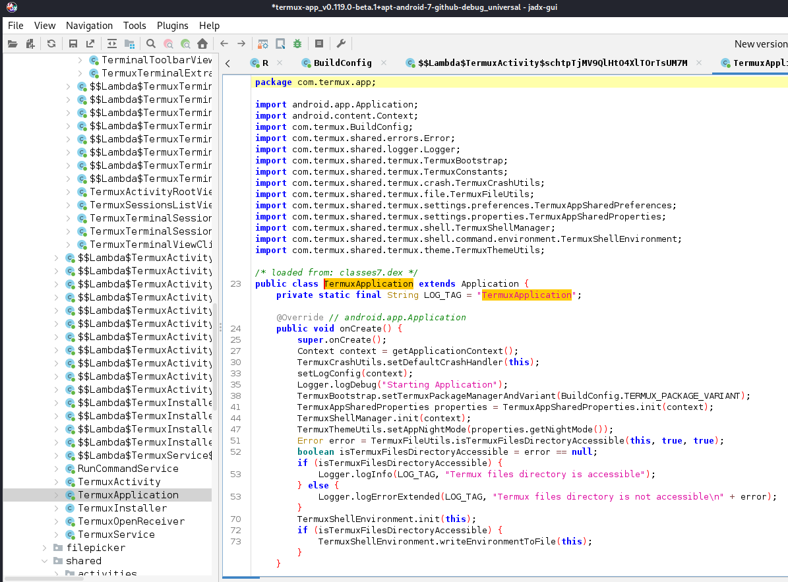
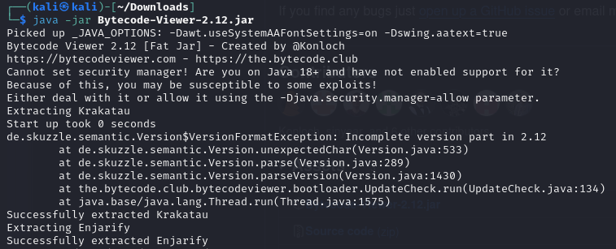
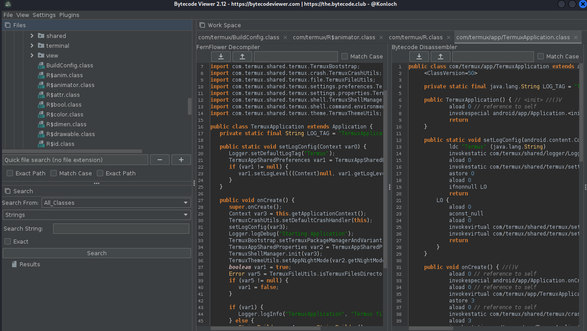

## a) Tutki tiedostoa h1.jpg jo opituilla työkaluilla. Mitä saat selville?

Latasin kuvan [Teron](https://terokarvinen.com/application-hacking/#h6-sulaa-hulluutta) sivuilta.

Aloitin kuvan tutkimisen ajamalla `files h1.jpg`, joka palautti joitakin tietoja.

Tulosteesta selvisi:
- Tiedostotyyppi JPEG
- Kuvassa on EXIF standardin mukaisia tietoja
	- Tiedosto käyttää TIFF (Tagged Image File Format) -rakennetta.
	- Resoluutio 86x94 yksikköä
	- Kuvan koko 1024x1024 pikseliä.
	
Hain seuraavaa komentoa varten kuvan wget -komennolla [Teron sivuilta](https://terokarvinen.com/application-hacking/h1.jpg). Tämä varmisti, että käsittelin alkuperäistä tiedostoa ja suljin pois mahdollisuuden, että selain olisi muuttanut tiedoston metatietoja.

Stat komento palauttaa tietoa tiedostosta, kuten sen koon, omistajan, oikeudet ja aikaleimat.

## b) Tutki tiedostoa h1.jpg binwalk:lla. Mitä tietoja löydät nyt tiedostosta? Mitä työkalua käyttäisit tiedostojen erottamiseen? (Huomaa, että binwalk versio 2.x ja 3.x toimivat eri tavalla.)

Tutkin tiedostoa h1.jpg käyttäen binwalk-työkalua. Ajoin `binwalk h1.jpg`
Tiedostoon oli upotettu useita ZIP-arkistoja, jotka sisältävät erityyppisiä tiedostoja, joten ajoin seuraavaksi `binwalk h1.jpg -e` joka purki ZIP -tiedostot

Hakemistorakenne viittaa siihen, että kuvaan on upotettu Microsoft Word -dokumentti

Tutkin tiedostoja hetken, eikä sieltä paljastunut mielenkiintoista tietoa.

## c) FOSS (Free Android OpenSource). Tutustu Android-sovelluksiin Offan (2024) listalta: [Android FOSS](https://github.com/offa/android-foss). Valitse listalla itsellesi mielenkiintoisin applikaatio ja mene sen GitHubiin.

Valitsin Offan listalta sovelluksen [Termux](https://github.com/termux/termux-app). Tämä valikoitui kohteeksi, sillä se oli minulle entuudestaan tuttu sovellus.
GitHubista löytyi useita APK-tiedostoja eri laitearkkitehtuureille joista valitsin ["universal" tiedoston](https://github.com/termux/termux-app/releases).

Avasin ohjelman unzip -komennolla.

Tiedosto oli Downloads kansiossa, joten kansion sisällä on muutakin, kuin vain Sovelluksen tiedostoja.

#### jadx

Kokeilin seuraavaksi jadx työkalua.
Asensin sen `sudo apt install jadx` -komennolla.

Avasin termux apk:n jadx työkalun gui versiossa. Täältä näki sovelluksen Java-lähdekoodin muodossa.
Selasin com.termux-paketteja, jotka sisälsivät Termuxin ydintoimintoja.

Latasin [Bytecode viewer](https://github.com/Konloch/bytecode-viewer/) -työkalun. 
Käynnistin sen `java -jar Bytecode-Viewer-2.12.jar` komennolla.

Avasin Termuxin APK-tiedoston.

Täälläkin työkalulla näki sovelluksen java koodia.
Bytecode Viewer mahdollistaa tarkastelun eri dekompilointimoottoreilla, kuten Procyon, CFR, ja Krakatau. Tässä oli käytössä Procyon.

## Lähteet

Sovellusten hakkerointi h6: https://terokarvinen.com/application-hacking/#h6-sulaa-hulluutta

jadx: https://github.com/skylot/jadx

termux: https://github.com/termux/termux-app

bytecode viewer: https://github.com/Konloch/bytecode-viewer/

android foss: https://github.com/offa/android-foss
