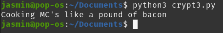
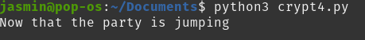

## x) tiivistä

Kryptografian vahvuus perustuu avaimen turvallisuuteen, ei algoritmin salaamiseen.

XOR-operaatio on yksinkertainen, mutta sen turvallisuus on erittäin heikko, jos avain on toistuva tai lyhyt.

Suurten lukujen käyttäminen tekee kryptosysteemien murtamisesta laskennallisesti mahdotonta nykyaikaisilla resursseilla.
(Schneier, 2015. Luvut 1.1, 1.4 & 1.7)

## a&b)
Nämä osat olen tehnyt aiemmin kurssin aikana
https://github.com/J-Huttunen/sovellustenhakkerointi/blob/main/h3.md#d.

## c)  3. Single-byte XOR cipher.
Tehtävänä oli purkaa viesti, joka oli XOR-salattu yhtä yksittäistä merkkiä vastaan. Haasteena oli löytää salauksessa käytetty avain ja palauttaa alkuperäinen viesti. 

Annettu hex-koodattu viesti oli: `1b37373331363f78151b7f2b783431333d78397828372d363c78373e783a393b3736`


```python
encrypted = bytes.fromhex("1b37373331363f78151b7f2b783431333d78373e783a393b3736")

common_chars = "ETAOIN SHRDLU etaoin shrdlu"

def decrypt_with_key(encrypted, key):

    return bytes([b ^ key for b in encrypted])

def score_text(text):

    try:
        decoded = text.decode("utf-8")
        score = 0
        for char in decoded:
            if char in common_chars:
                score += 2  
            elif char.isalpha() or char.isspace():
                score += 1  
        return score
    except UnicodeDecodeError:
        return 0  

best_score = 0
best_key = None
best_message = None

for key in range(256):
    decrypted = decrypt_with_key(encrypted, key)
    score = score_text(decrypted)
    if score > best_score:
        best_score = score
        best_key = key
        best_message = decrypted.decode("utf-8", errors="ignore")

print(f"{best_message}")
```

Käytin tehtävän ratkaisuun apuna [Teron vinkkejä](https://terokarvinen.com/getting-started-python-cryptopals/)

```python
encrypted = bytes.fromhex("1b37373331363f78151b7f2b783431333d78373e783a393b3736")
```
Tässä hex-koodattu syöte muunnettiin tavulistaksi `bytes.fromhex()` -funktiolla.

```python
def decrypt_with_key(encrypted, key):

    return bytes([b ^ key for b in encrypted])
```
- XOR-operaatio suoritetaan jokaiselle viestin tavulle annetulla avaimella.
- Palauttaa purkamisen tuloksen tavulistana.

```python
def score_text(text):

    try:
        decoded = text.decode("utf-8")
        score = 0
        for char in decoded:
            if char in common_chars:
                score += 2  
            elif char.isalpha() or char.isspace():
                score += 1 
        return score
    except UnicodeDecodeError:
        return 0 
```
Tämä arvioi "englanninkielisyyttä".
- `common_chars` sisältää yleisimpiä kirjaimia.
- Purettu viesti dekoodataan UTF-8-tekstiksi.
- Jokaiselle merkille annetaan pisteitä
- Ei-tulostettavat merkit saavat 0 pistettä.

```python
best_score = 0
best_key = None
best_message = None

for key in range(256):
    decrypted = decrypt_with_key(encrypted, key)
    score = score_text(decrypted)
    if score > best_score:
        best_score = score
        best_key = key
        best_message = decrypted.decode("utf-8", errors="ignore")

```
- Käydään läpi kaikki mahdolliset avaimet (0–255).
- Puretaan viesti jokaisella avaimella.
- Pisteytetään purettu viesti.

  


Tämä koodi auttaa myös seuraavassa tehtävässä.

## d) 4. Detect single-character XOR

Latasin tehtävää varten [cryptopals tiedoston](https://cryptopals.com/static/challenge-data/4.txt).
Tiedoston jokaisella rivillä oli hex-koodattu viesti, joista yksi oli XORattu yksitavuista avainta käyttäen. 

Lähdin lisämään edellisen ratkaisun koodiin tämän tehtävän ratkaisun kannalta oleellisia asioita. Tässäkin tehtävässä nojasin [Teron vinkkeihin](https://terokarvinen.com/getting-started-python-cryptopals/)

```python
def decrypt_with_key(encrypted, key):

    return bytes([b ^ key for b in encrypted])

def score_text(text):

    try:
        decoded = text.decode("utf-8")
        score = 0
        for char in decoded:
            if char in common_chars:
                score += 2 
            elif char.isalpha() or char.isspace():
                score += 1  
        return score
    except UnicodeDecodeError:
        return 0  

best_score = 0
best_line = None
best_key = None
best_message = None

with open("4.txt", "r") as file:
    lines = file.readlines()

for line in lines:
    encrypted = bytes.fromhex(line.strip())
    for key in range(256):
        decrypted = decrypt_with_key(encrypted, key)
        score = score_text(decrypted)
        if score > best_score:
            best_score = score
            best_line = line.strip()
            best_key = key
            best_message = decrypted.decode("utf-8", errors="ignore")


print(f"{best_message}")
```

  

Lisäyksenä edellisen tehtävän koodiin oli:
```python
with open("4.txt", "r") as file:
    lines = file.readlines()
```
- Jokainen tiedoston rivi luetaan ja käsitellään itsenäisesti.

```python
for line in lines:
    encrypted = bytes.fromhex(line.strip()) 
    for key in range(256): 
        decrypted = decrypt_with_key(encrypted, key)
        score = score_text(decrypted)
        if score > best_score:
            best_score = score
            best_line = line.strip()
            best_key = key
            best_message = decrypted.decode("utf-8", errors="ignore")

```
Jokaiselle riville tehdään sama purku kuin edellisessä tehtävässä
Paras tulos tallennetaan, riippumatta siitä, miltä riviltä se tuli.

|cryptopals 3|cryptopals 4|
|-|-|
|Yksi hex-merkkijono|Useita hex-merkkijonoja tiedostossa|
|Kaikki avaimet yhdelle viestille|Kaikki avaimet jokaiselle viestille|
|Yhden parhaan viestin purkaminen|Tiedoston parhaan viestin löytäminen|

## Lähteet
Sovellusten hakkerointi: https://terokarvinen.com/application-hacking/#h7-uhagre2

Schneier, B. 2015. Applied Cryptography: Protocols, Algorithms and Source Code in C, 20th Anniversary Edition

Karvinen, T. Getting Started with Cryptopals using Python. Luettavissa: https://terokarvinen.com/getting-started-python-cryptopals/
